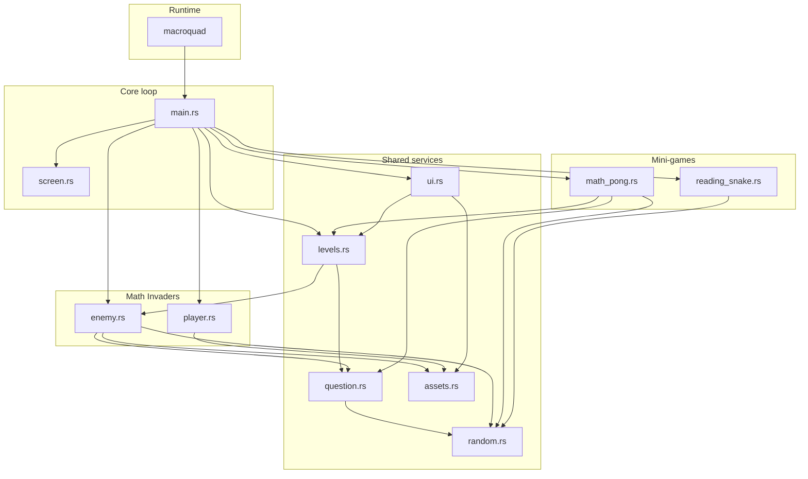
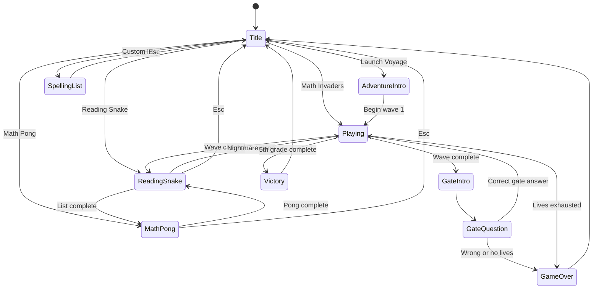
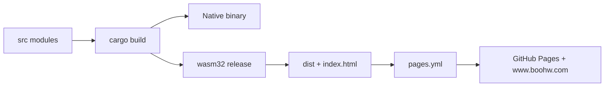

# Star Crusher

Star Crusher is an educational arcade collection about two young space travelers flying between dungeon planets. The current encounters include a Time Pilot-style Math Invaders game where drifting numbered targets display possible answers to grade-level math questions, Math Pong, and Reading Snake, a Snake-inspired mini game where players collect letters in order to spell words.

Current build: `1.5.2`

## Latest Mobile Release

- Added a web touch bridge so iPhone Safari taps on canvas buttons trigger the matching game controls.
- Migrated the virtual playfield from the older 1024x768 4:3 layout to a 1280x720 16:9 baseline.
- Reworked portrait mobile menus into large rounded tap targets, matching the web `Site` button style.
- Added explicit mobile `CONTINUE`, `START`, `BACK`, and `TITLE` buttons so players do not have to guess at swipe or keyboard prompts.
- Refreshed the space-traveler color palette across the title, adventure intro, gates, overlays, HUDs, Math Invaders, Reading Snake, and Math Pong.
- Rebuilt the checked-in `star-crusher.wasm` artifact for the static site.

## Features

- Seven-grade progression from Preschool through 5th Grade.
- Grade-appropriate math questions covering counting, arithmetic, multiplication, division, fractions, percentages, pre-algebra, area, volume, and ratios.
- Launch Voyage opens a guided planet route: intro, first Math Invaders wave, Reading Snake, Math Pong, Nightmare Snake, then continued Math Invaders progression.
- Math Invaders waves with Time Pilot-style drifting numbered targets tied to the active math question.
- Math Invaders shows the active question in a larger top-centered banner, with targets kept below the banner.
- Preschool shape prompts use default-font-safe ASCII markers so shapes display reliably.
- Kindergarten number-recognition prompts use words, such as `Shoot number three`, while targets remain numeric.
- Question gates between waves that require typed answers to advance.
- Question gate prompts and answer input are spaced to avoid overlapping the wave-complete instructions.
- Question gates use larger portrait-mode number pad targets for phone play.
- Math Pong mode for launching a straight ball into randomly placed numbered targets.
- Reading Snake mini game for letter order, word recognition, and definition practice, with randomized default or custom spelling lists and Nightmare mode.
- Reading Snake shows definition cards, keeps the active definition visible above the board, and keeps new letter tiles away from the snake head.
- Reading Snake supports a portrait-mode thumb D-pad on mobile, with swipe steering still available as a fallback.
- Reading Snake definition cards show part of speech and use larger definition text for easier reading.
- Completing the standard Reading Snake list starts a bonus Nightmare round using the same words in the same randomized order.
- In Launch Voyage, completing normal Reading Snake advances directly to Math Pong instead of the standalone bonus round.
- Space-travel title menu with two travelers, a ship, dungeon planets, a focused main adventure menu, and a Mission Select submenu.
- Portrait mobile screens show an in-canvas `TITLE` / `BACK` button for touch navigation.
- Portrait mobile menus use large rounded touch buttons styled like the site controls.
- Portrait mobile gameplay uses compact HUD and question panels that leave room for the site button.
- Game over and victory stat panels are centered with their score and progress text.
- Procedural graphics only; no external assets or fonts required.
- Launches in a 1920x1080 fullscreen window with a fixed 1280x720 virtual playfield, with 16:9 title, gate, overlay, HUD, and mini-game layouts.

## Controls

Title menu controls:

- Move menu cursor: `Up` / `Down` arrow keys or `W` / `S`
- Launch selected option: `Enter` or `Space`
- Main menu options: `Launch Voyage`, `Mission Select`, and `Word Cargo`
- Mission Select options: `Reading Planet`, `Math Orbit`, and `Night Planet`
- Return from Mission Select to the main menu: `Esc`
- Continue Launch Voyage intro: `Enter` or `Space`
- Return from Launch Voyage intro to title: `Esc`
- Return from adventure mini-games to title and cancel the adventure: `Esc`
- Direct shortcut for Math Invaders: `M`
- Direct shortcut for Mission Select from the main menu: `P`
- Direct shortcut for Math Pong from Mission Select: `P`
- Direct shortcut for Reading Snake: `R`
- Direct shortcut for Reading Snake Nightmare: `N`
- Direct shortcut for Word Cargo: `L`
- On mobile, tap menu rows directly.
- On mobile, tap the in-canvas `BACK` button to return from Mission Select to the main menu.
- On mobile, use explicit `CONTINUE`, `START`, `BACK`, and `TITLE` buttons for story, gate, restart, and navigation screens.

Math Invaders controls:

- Move: `Left` / `Right` arrow keys or `A` / `D`
- Shoot: `Space`
- Start / continue: `Enter` or `Space`
- Return from mini games to title: `Esc`
- Type gate answers with number keys, then press `Enter`
- Delete typed answer characters with `Backspace`
- On mobile, hold or drag in the lower play area to move and fire.
- On mobile, tap `TITLE` to return to the title menu.
- On mobile, use the enlarged gate number pad and `OK` button to submit answers.

Reading Snake controls:

- Move: arrow keys or `W` / `A` / `S` / `D`
- Start spelling after a definition card: `Enter` or `Space`
- Restart after game over: `Enter` or `Space`
- Return to title: `Esc`
- On mobile, tap the portrait thumb D-pad, or swipe in the desired direction as a fallback.
- On mobile, tap `START` on definition cards and game-over screens to continue.
- On mobile, tap `TITLE` to return to the title menu.

Reading Snake layout and safety:

- The definition card shows the part of speech before each word, and the definition remains visible above the playfield.
- The blank word prompt appears below the playfield.
- After each correct letter, the next target and decoy letters avoid a 6-by-6 area around the snake head.

Reading Snake Nightmare rules:

- Start from title: `N`
- All letter tiles use the same color
- Wrong letters cost one life
- Completing a nightmare word awards one bonus life, up to 9 lives

Spelling-list entry controls:

- Start list entry from title: `L`
- Type `word: definition` pairs separated by semicolons, then press `Enter`
- Press `N` from list entry to play Nightmare with the typed list
- Plain word lists separated by spaces or commas still work
- Delete typed characters with `Backspace`
- Leave the list blank and press `Enter` to use the default words
- Return to title without starting: `Esc`
- On mobile, tap `PLAY` to start normal Reading Snake with the typed list.
- On mobile, tap `NIGHT` to start Nightmare Snake with the typed list.
- On mobile, tap `TITLE` to return to the title menu.

Math Pong controls:

- Move paddle: `Left` / `Right` arrow keys or `A` / `D`
- Launch ball: `Space` or `Enter`
- Restart after game over: `Enter` or `Space`
- Return to title: `Esc`
- On mobile, drag or hold near the lower play area to move the paddle.
- On mobile, drag or hold near the lower play area to move the paddle, then tap `START` to launch the ball.
- On mobile, tap `TITLE` to return to the title menu.

## Requirements

- Rust 2021 toolchain
- Cargo

Install Rust from <https://www.rust-lang.org/tools/install> if needed.

## Run The Game

```bash
cargo run
```

Or use the included launcher:

```bash
./run-game
```

## Check Compilation

```bash
cargo check
```

## Project Structure

```text
run-game             Convenience launcher that loads rustup environment and runs Cargo
src/main.rs          Game state machine and update/draw loop
src/screen.rs        Window configuration, fullscreen launch, and virtual screen camera
src/levels.rs        Grade progression and difficulty configuration
src/question.rs      Grade-specific math question generation
src/random.rs        Shared randomization helpers
src/math_pong.rs     Math Pong number target mini game
src/reading_snake.rs Reading Snake mini game
src/enemy.rs         Numbered Math Invaders targets, movement, explosions
src/player.rs        Player ship, player bullets, enemy bullets
src/ui.rs            HUD, title, mobile touch buttons, game over, victory, and question gate UI
src/assets.rs        Procedural drawing helpers for ships, enemies, stars, effects
star-crusher.wasm    Checked-in WASM artifact used by the static landing page
index.html           Static landing page and Macroquad WASM loader
```

## Architecture

Single binary crate (`star-crusher`) on **macroquad**. `main.rs` owns the update/draw loop and `GameMode` state machine; all other logic lives in flat `src/` modules.

### Module dependencies



### Game modes and Launch Voyage flow



### Build and deploy



## Gameplay Loop

Math Invaders:

1. Choose `Launch Voyage` to see the space-route intro, then press `Enter` or `Space` through the final prompt to begin.
2. Clear the first Math Invaders wave to enter normal Reading Snake automatically.
3. Complete normal Reading Snake to enter Math Pong automatically.
4. Complete Math Pong to enter Nightmare Snake automatically.
5. Complete Nightmare Snake to return to Math Invaders progression and answer the wave-complete gate.
6. Choose `Math Invaders` from the title menu, or press `M`, to launch standalone Math Invaders immediately.
7. Read the active math question and find the drifting target showing the correct answer.
8. Use the top-centered question banner; targets spawn and drift below it for visibility.
9. Shoot the correct drifting number to score and receive a new question for the remaining targets.
10. Shooting an incorrect number costs one life and leaves that target in play.
11. Clear all numbered targets, then answer typed math questions at the wave-complete gate.
12. Advance through each grade until the 5th Grade wave is completed.

Math Pong:

1. Choose `Mission Select`, then choose `Math Orbit`, or press `P` from Mission Select.
2. Read the math question and identify the correct numbered target.
3. Move the paddle under the correct number before launching the ball.
4. Launch straight upward into the correct number to clear the question.
5. Clear five questions to advance to the next grade.

Reading Snake:

1. Choose `Mission Select`, then choose `Reading Planet`, or press `R`, to play with the default word list.
2. Or choose `Word Cargo`, type weekly spelling words with definitions, then press `Enter`.
3. Use the format `apple: a fruit; moon: shines at night` for custom definitions.
4. Read the definition card, then press `Enter` or `Space` to start spelling.
5. Use the visible definition above the board and follow the blank word prompt below the board.
6. Steer the snake into the next correct letter.
7. Avoid wrong letters, walls, and the snake's own tail.
8. New letters appear away from the snake head so the player has room to react.
9. Complete every word in the randomized list to unlock a bonus Nightmare pass through those same words in the same order.

Reading Snake Nightmare:

1. Choose `Mission Select`, then choose `Night Planet`, or press `N`.
2. Or choose `Word Cargo`, type a custom spelling list, then press `N`.
3. Read the definition card and spell the hidden word.
4. Choose carefully because all letter tiles look the same.
5. Complete the word to earn a bonus life.

## Development Notes

- This is a binary Rust project, so `Cargo.lock` is intentionally committed.
- Build output in `target/` is ignored.
- The game uses `macroquad` for windowing, input, and drawing, and `rand` for question/enemy randomization.

## Web Deployment (GitHub Pages)

This project builds to WASM and deploys automatically from the `main` branch via GitHub Actions to [GitHub Pages](https://nontechit.github.io/StarCrusher/) and the custom domain [www.boohw.com](https://www.boohw.com/).

### How It Works

1. Pushing to `main` triggers `.github/workflows/pages.yml`.
2. The action installs Rust, compiles the WASM target, and stages `index.html`, `CNAME`, and `star-crusher.wasm` in `dist/`.
3. `actions/deploy-pages` publishes the `dist/` artifact to GitHub Pages.
4. GitHub Pages serves the same build at `www.boohw.com` when the custom domain is configured.

### Custom Domain (www.boohw.com)

The repository includes a `CNAME` file for **www.boohw.com**. To complete or verify setup:

1. Go to **Settings -> Pages** on this repo and add `www.boohw.com` as a custom domain.
2. Add these DNS records at your registrar for boohw.com:

| Type    | Name          | Value                  |
|---------|---------------|------------------------|
| CNAME   | www           | nontechit.github.io    |
| A       | @             | 185.199.108.153        |
| A       | @             | 185.199.109.153        |
| A       | @             | 185.199.110.153        |
| A       | @             | 185.199.111.153        |

3. After DNS propagates (up to 48 hours), enable **Enforce HTTPS** in Pages settings.

### Local WASM Build

```bash
rustup target add wasm32-unknown-unknown
cargo build --target wasm32-unknown-unknown --release
# Output: target/wasm32-unknown-unknown/release/star-crusher.wasm
```

To update the static landing-page artifact after a local WASM build:

```powershell
Copy-Item -LiteralPath target\wasm32-unknown-unknown\release\star-crusher.wasm -Destination star-crusher.wasm
```

Then open `index.html` in a browser through a local server because WASM module loading is restricted from direct file URLs:

```bash
python3 -m http.server 8080
# Visit http://localhost:8080
```
